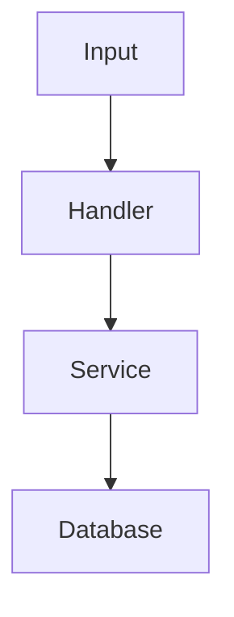

# Research Phase

## Phase Protocol

1. Announce: Research phase.
2. Verify inputs: `00-ticket.md` and `01-questions.md` are available.
3. Allowed: read-only codebase inspection, citing files/symbols/tests. Prohibited: code edits,
   implementation recommendations, design proposals.
4. Perform phase work: gather objective facts about the current codebase.
5. Write artifact: `02-research.md`.
6. Self-review: separate facts from assumptions; no recommendations or solution bias.
7. Stop for human approval.

## Inputs

Task artifact:

{{ticketArtifact}}

Questions artifact:

{{questionsArtifact}}

## Mission

Create `02-research.md`.

Do not edit code.

Do not propose implementation yet.

Gather objective facts about the current codebase.

## Rules

- Read relevant files fully enough to understand behavior.
- Prefer direct evidence from files, tests, schemas, routes, commands, and configuration.
- Cite file paths and symbols.
- Include line numbers when available.
- Separate facts from assumptions.
- Separate current behavior from possible future behavior.
- Do not recommend an approach in this phase.
- If research reveals the original task is wrong or incomplete, surface that clearly.

## Output Format

# Research

## Executive Summary

Short summary of what the codebase currently does.

## Relevant Code Paths

List relevant files, modules, functions, components, routes, schemas, jobs, commands, and tests.

Use this format:

- `path/to/file.ts`
  - Relevant symbols:
  - Current responsibility:
  - Notes:

## Current Behavior

Explain how the relevant system works today.

## Data Flow

Include a Mermaid diagram if useful.

## Existing Patterns to Follow

Patterns, conventions, helpers, abstractions, test styles, error handling, naming, etc.

## Existing Patterns to Avoid or Question

Legacy code, inconsistencies, risky areas, unclear ownership, brittle patterns.

## Tests and Validation Surface

List existing tests and commands likely relevant to this task.

## Integration Points

External APIs, databases, queues, auth, webhooks, background jobs, UI surfaces.

## Risks and Unknowns

List remaining uncertainty.

## Questions That Require Human Judgment

Only questions that code inspection could not answer.

## Stop Condition

Write the artifact and stop. Do not design or plan yet.
