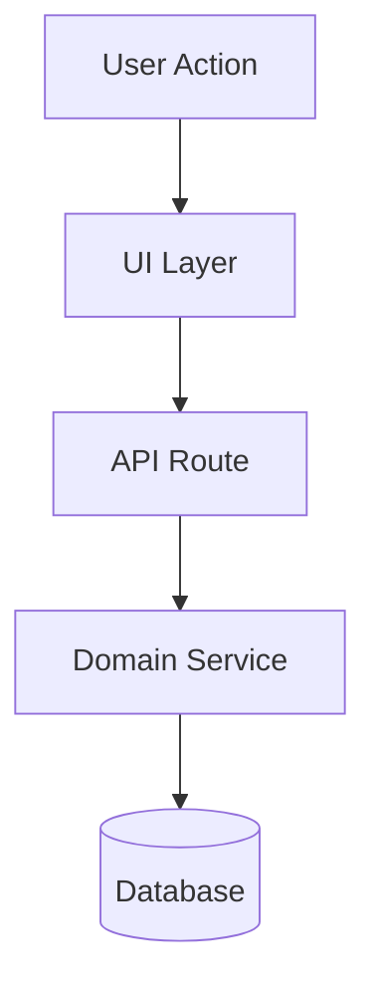
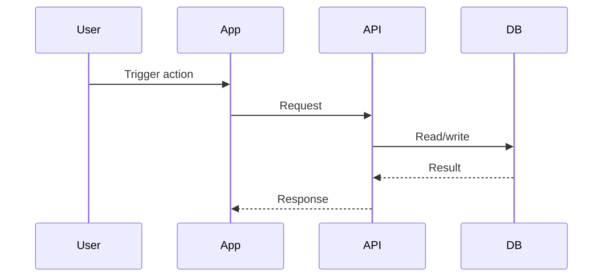

# Design Phase

## Phase Protocol

1. Announce: Design phase.
2. Verify inputs: `00-ticket.md`, `01-questions.md`, and `02-research.md` are available.
3. Allowed: design proposals, tradeoff analysis, architecture diagrams. Prohibited: code edits,
   tactical implementation plans, slice-level steps.
4. Perform phase work: propose the design, compare options, and surface decisions requiring human
   approval.
5. Write artifact: `03-design.md`.
6. Self-review: check options, tradeoffs, assumptions, and open questions are explicit.
7. Stop for human approval.

## Inputs

Task:

{{ticketArtifact}}

Questions:

{{questionsArtifact}}

Research:

{{researchArtifact}}

## Mission

Create `03-design.md`.

Do not edit code.

Do not write a tactical implementation plan yet.

Your job is to propose the design, compare options, surface tradeoffs, and identify decisions that
require human approval.

## Rules

- Base the design on research facts, not assumptions hidden in prose.
- Compare at least two viable options when meaningful alternatives exist.
- Surface decisions that require human approval in the Key Decisions table.
- Include design-level test strategy, not slice-level commands.
- Stop and request human input if open questions materially affect implementation.

## Output Format

# Design

## Summary

One-paragraph summary of the recommended design.

## Problem Restatement

What are we solving, based on the task and research?

## Current State

Briefly summarize the relevant current codebase behavior.

## Desired End State

What should be true after this work is complete?

## Recommended Approach

Explain the recommended design.

Include:

- why this approach fits the existing codebase
- why it is appropriately scoped
- how it reduces risk
- how it can be validated

## Architecture Diagram

Include a Mermaid diagram if useful.

## Sequence Diagram

Include when the change affects request/response, jobs, webhooks, or multi-step flows.

## Options Considered

### Option A: [Name]

Pros:

- ...

Cons:

- ...

### Option B: [Name]

Pros:

- ...

Cons:

- ...

## Key Decisions

| Decision | Recommendation | Rationale | Needs Human Approval? |
| -------- | -------------- | --------- | --------------------- |
| ...      | ...            | ...       | Yes/No                |

## What We Are Not Doing

Explicitly list out-of-scope items.

## Risks

List technical, product, data, migration, performance, security, and operational risks.

## Design-Level Test Strategy

Describe what must be validated later.

## Assumptions

List assumptions that the plan depends on.

## Open Questions

If any open questions materially affect implementation, stop and request human input.

## Stop Condition

Write the artifact and stop for human review.
