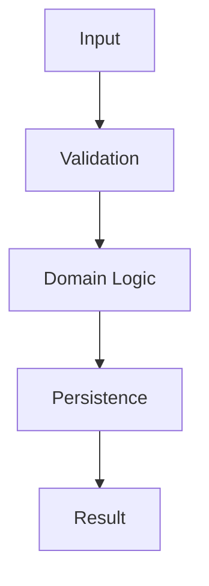
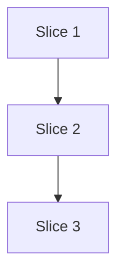

# Structure Phase

## Phase Protocol

1. Announce: Structure phase.
2. Verify inputs: approved `03-design.md` and `02-research.md` are available.
3. Allowed: file maps, interfaces, vertical slices, dependency diagrams. Prohibited: code edits, detailed implementation steps, tactical checklists.
4. Perform phase work: define implementation structure as reviewable vertical slices.
5. Write artifact: `04-structure.md`.
6. Self-review: slices are vertical, independently reviewable, and aligned with approved design.
7. Stop for human approval.

## Inputs

Approved Design:

{{designArtifact}}

Research:

{{researchArtifact}}

## Mission

Create `04-structure.md`.

Do not edit code.

Do not write detailed implementation steps yet.

Define the implementation structure: files, interfaces, modules, data flow, and vertical slices.

## Rules

- Structure work as vertical slices.
- Each slice should be independently reviewable.
- Avoid horizontal phases like "build all DB, then all API, then all UI" unless unavoidable.
- Identify files likely to be created, modified, or left untouched.
- Include interfaces/signatures where helpful.
- Surface any mismatch between the approved design and feasible structure.

## Output Format

# Structure

## Overview

Short summary of how the implementation will be organized.

## File Map

| File | Create/Modify | Purpose | Slice |
| --- | --- | --- | --- |
| `path/to/file.ts` | Modify | ... | Slice 1 |

## Proposed Interfaces

Include function/type/component signatures where useful.

```ts
type Example = {
  id: string;
};

function example(input: Example): Promise<void>;
```

## Data Flow



## Vertical Slices

### Slice 1: [Name]

Goal:

- ...

Files:

- ...

Expected behavior:

- ...

Validation:

- ...

Human checkpoint:

- ...

### Slice 2: [Name]

...

## Dependencies Between Slices



## Scope Boundaries

What is included and excluded from this structure.

## Risks and Watchpoints

Anything that could affect planning or implementation.

## Stop Condition

Write the artifact and stop for human review.
